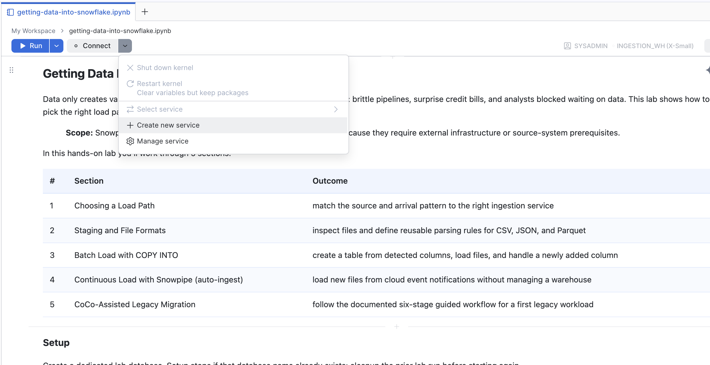
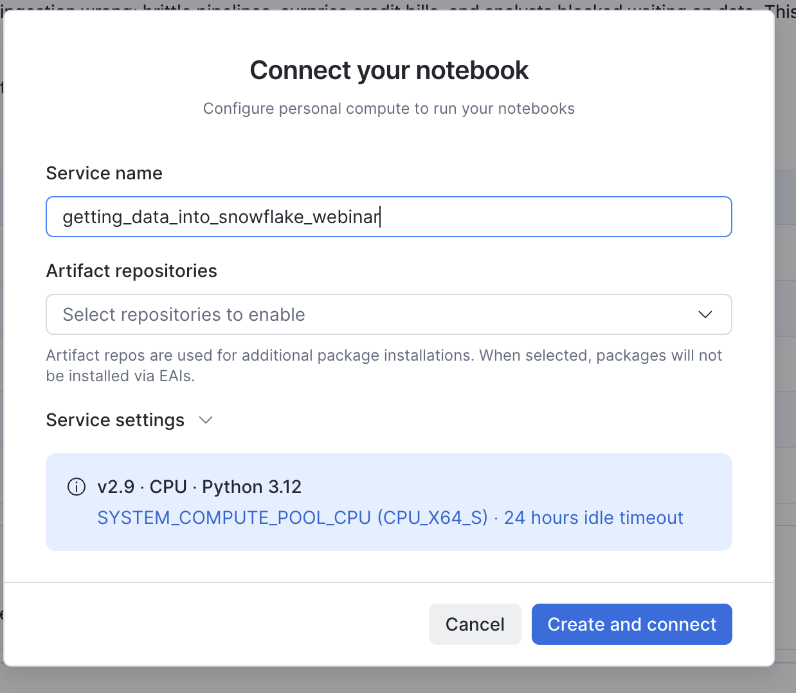
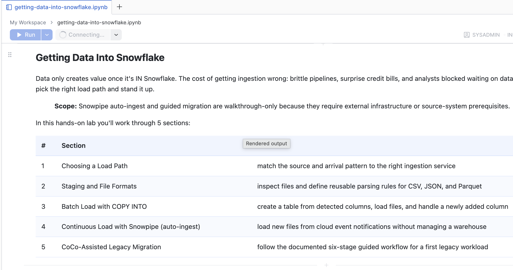
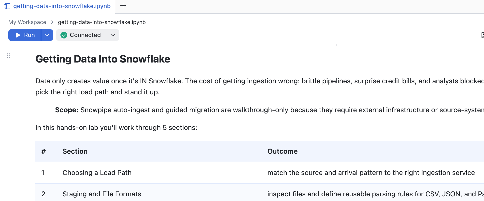

# Getting Data Into Snowflake

A hands-on lab for choosing an ingestion path, inspecting staged files,
creating tables from detected schemas, loading batches with `COPY INTO`, and
understanding continuous ingestion and guided migration options.

## Format

A self-paced, hands-on lab that takes about an hour. Work through the sections
in order in your own Snowflake account. The runnable file-loading path uses
public Tasty Bytes sample data.

## Sections

| # | Section | What you'll cover | Hands-on |
|---|---|---|---|
| 1 | Choosing a Load Path | `COPY INTO`, Snowpipe, Snowpipe Streaming, Openflow, and partner connectors | Concept |
| 2 | Staging and File Formats | External and internal stages; CSV, JSON, and Parquet; file inspection | Yes |
| 3 | Batch Load with `COPY INTO` | Table creation, load validation, repeatable loads, schema inference, and schema evolution | Yes |
| 4 | Continuous Load with Snowpipe | Amazon S3 auto-ingest event flow and recovery setup | Walkthrough |
| 5 | Guided Legacy Migration | The Snowflake AIM Agent for Data Warehouses and SnowConvert workflow | Walkthrough |

## Prerequisites

- A Snowflake account where you can use the `SYSADMIN` role
- A compute pool for the notebook service — the default `SYSTEM_COMPUTE_POOL_CPU` works
- **No warehouse to create up front.** The Setup cell creates its own X-Small query
  warehouse, `GETTING_DATA_INTO_SNOWFLAKE_WH`, and switches to it. If Snowsight asks
  you to pick a warehouse before the first cell runs, any size (XS) is fine — Setup
  takes over from there, and Cleanup drops the lab warehouse at the end.

The runnable batch load reads from a public Amazon S3 bucket, so it does not
require a storage integration or cloud credentials. The Snowpipe and migration
sections are walkthroughs because they depend on infrastructure or source
systems outside this self-contained lab.

## How to Run the Notebook

This is a **Snowflake Notebook in Workspaces**. You'll download the notebook, upload it
into a workspace, create a compute service to run it, then run the cells in order.

### 1. Download the notebook

Download
[`getting-data-into-snowflake.ipynb`](getting-data-into-snowflake.ipynb) from this
repository's GitHub page to your computer.

### 2. Open Workspaces

Sign in to Snowsight. In the left nav under **Work with data**, hover over **Projects**
and click **Workspaces**.

### 3. Select your workspace

Click the workspace dropdown at the top-left and select **My Workspace** — make sure it
shows the checkmark.

### 4. Upload the notebook

Click **+ Add new**, choose **Upload files**, and select the `.ipynb` you downloaded. It
opens in the editor.

### 5. Create the notebook service (compute)

Click the arrow next to the **Connect** button, then **+ Create new service**.

In **Connect your notebook**, set the **Service name** to
`getting_data_into_snowflake_webinar` and click **Create and connect**. The defaults are
fine (Container Runtime, CPU, Python 3.12, `SYSTEM_COMPUTE_POOL_CPU`, 24-hour idle
timeout).

While it connects, the **Connect** button is greyed out with a **Connecting** spinner —
this usually takes a minute or less.

When it's ready, the button shows a green check and **Connected**.

### 6. Run the lab

**Select the `SYSADMIN` role** in the picker (top-left) before you run anything — the lab
creates data-layer objects (warehouse, database, stages, file formats, tables) as
`SYSADMIN`. Then:

1. Run the **Setup** cell first. It tags the session, creates the
   `GETTING_DATA_INTO_SNOWFLAKE_WH` warehouse and the
   `GETTING_DATA_INTO_SNOWFLAKE_HOL` database, and selects the `PUBLIC` schema.
2. Work through Sections 1 through 3 in order. Each runnable step is numbered `X.Y`
   (for example, Step 2.1, Step 3.4). Run a cell by selecting it and clicking the
   **▶ Run cell** button.
3. Read the walkthrough cells in Sections 4 and 5. Don't run the Snowpipe reference
   SQL until you point it at your own bucket and configure the S3 event notification.
4. Run the **Cleanup** cell at the end to drop everything the lab created, including
   the lab warehouse.

> **What a successful run looks like:** each cell turns **green** with a result table or a
> "statement executed successfully" message. The menu preview returns sample rows, the
> validation step returns **no rows** (`VALIDATE` reports only errors, so an empty
> result means a clean load), and the customer table ends with a
> `LOYALTY_TIER` column — earlier rows hold `NULL` there, later rows hold `GOLD` and
> `SILVER`.

> **Re-running:** Setup and Cleanup are both idempotent, so you can run the notebook from
> top to bottom again without dropping anything by hand first. Later cells depend on
> objects created by earlier cells, so run the sections in order rather than jumping in
> partway.

## What the Lab Demonstrates

- Snowpipe uses cloud event notifications to detect newly arrived files and
  Snowflake-supplied compute resources to load them.
- Use either bulk loading or Snowpipe for a given set of files. Their load
  histories are separate, so using both for the same files can duplicate data.
- Snowpipe Streaming is the row-ingestion path; Snowpipe is the file-ingestion
  path.
- `INFER_SCHEMA` output can define a table created with `USING TEMPLATE`.
- File-based schema evolution requires `ENABLE_SCHEMA_EVOLUTION`,
  `MATCH_BY_COLUMN_NAME`, and either `EVOLVE SCHEMA` or table ownership. For
  CSV with `PARSE_HEADER`, `ERROR_ON_COLUMN_COUNT_MISMATCH` must be `FALSE`.
- The Snowflake AIM Agent for Data Warehouses guides a migration through
  Connect, Init, Register, Convert, Assess, and Migrate stages.

Sources:

- [Snowpipe](https://docs.snowflake.com/en/user-guide/data-load-snowpipe-intro)
- [Snowpipe Streaming](https://docs.snowflake.com/en/user-guide/snowpipe-streaming/data-load-snowpipe-streaming-overview)
- [Automatic table schema evolution](https://docs.snowflake.com/en/user-guide/data-load-schema-evolution)
- [Snowflake AIM Agent for Data Warehouses](https://docs.snowflake.com/en/migrations/aim-for-datawarehouses/overview)
- [Snowflake Notebooks in Workspaces](https://docs.snowflake.com/en/user-guide/ui-snowsight/notebooks-in-workspaces/notebooks-in-workspaces-overview)

## Object Naming

All lab objects use a `GDIS_` prefix, such as `GDIS_STAGE` and
`GDIS_MENU_TABLE`, so they are easy to identify. The cleanup cell drops the
`GETTING_DATA_INTO_SNOWFLAKE_HOL` database, which contains the lab objects, and
the `GETTING_DATA_INTO_SNOWFLAKE_WH` warehouse that Setup created.

## Series Context

This lab is part of a multi-part Snowflake administration webinar series. Each
lab stands alone and does not depend on objects from another session.

## License

Licensed under the [Apache License 2.0](LICENSE).

## Disclaimer

This repository is a teaching artifact, not an officially supported Snowflake
product. It creates and drops database objects in the account where you run it.
Use a trial, sandbox, or development account rather than production, review each
cell before running it, replace every walkthrough placeholder with your own
values, and run the cleanup cell when finished.